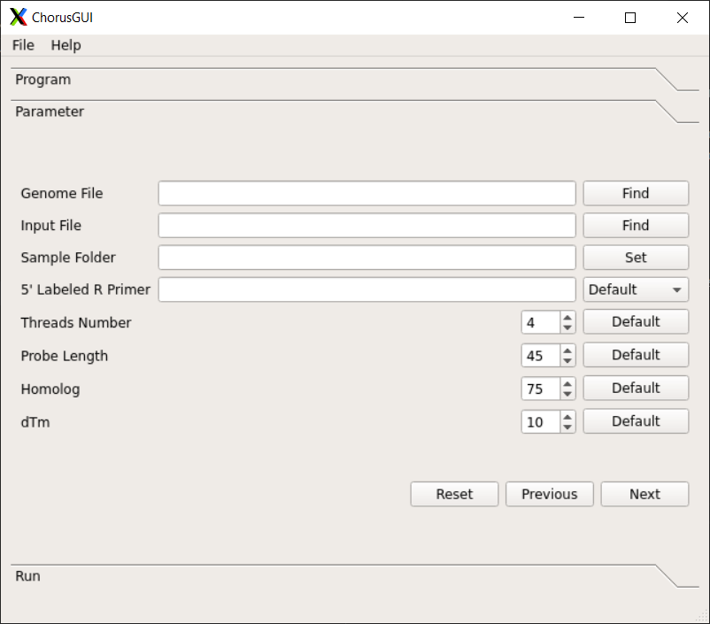
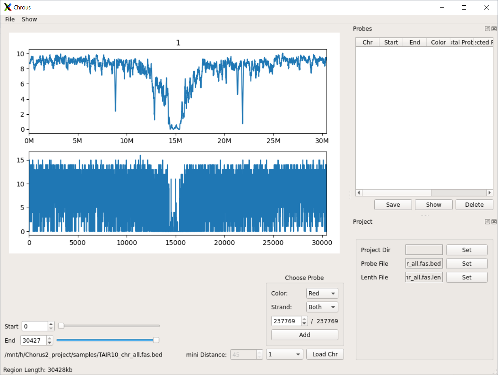

Description of functions in Chorus2
====================================

Chorus2
--------

Function
*********
Chorus2 Software for Oligo FISH probe design

Parameters
***********
.. code-block:: bash

    -j JELLYFISH, --jellyfish JELLYFISH
                          The path where Jellyfish software installed
    -b BWA, --bwa BWA     The path where BWA software installed
    -g GENOME, --genome GENOME
                          Fasta format genome file, should include all sequences
                          from genome
    -i INPUT, --input INPUT
                          Fasta format input file, can be whole genome, a
                          chromosome or one region from genome
    -s SAVED, --save SAVED
                          The output folder for saving results
    -p PRIMER, --primer PRIMER
                          A specific 5' labeled R primer for PCR reaction. For
                          example: CGTGGTCGCGTCTCA. (Default is none)
    -t THREADS, --threads THREADS
                          Number of threads or CPUs to use. (Default: 1)
    -l LENGTH, --length LENGTH
                          The probe length. (Default: 45)
    --homology HOMOLOGY   The maximum homology(%) between target sequence and
                          probe, range from 50 to 100. (Default: 75)
    -d DTM, --dtm DTM     The minimum value of dTm (hybrid Tm - hairpin Tm),
                          range from 0 to 37. (Default: 10)
    --skipdtm SKIPDTM     skip calculate dtm, for oligo longer than 50.
    --step STEP           The step length for k-mer searching in a sliding
                          window, step length>=1. (Default: 5)
    --docker DOCKER       Only used in Docker version of Chorus
    --ploidy PLOIDY       The ploidy of the given genome (test version).
                          (Default: 2)

Usage
******
.. code-block:: bash

    $ Chorus2 -i TAIR10_chr_all.fas -g TAIR10_chr_all.fas -t 4 \
              -j /opt/software/jellyfish/bin/jellyfish -b /opt/software/bwa/bwa -s sample

ChorusNGSfilter
----------------

Function
*********
ChorusNGSfilter for counting Oligo FISH probe k-mer score using NGS data

Parameters
***********
.. code-block:: bash

    -j JELLYFISH, --jellyfish JELLYFISH
                          The path where Jellyfish software installed
    -g GENOME, --genome GENOME
                          Fasta format genome file, should include all sequences
                          from genome
    -i INPUT, --input INPUT
                          Fastq format input files contain reads from whole
                          genome shotgun sequencing, files can be gzipped.
                          Multiple files separate with ",". For example:
                          1.fq.gz,2.fq.gz
    -jfile JFILE, --jellyfishfile JFILE
                          prebuild jellyfish index file, conflict with input
                          argument.
    -z {gz,text}, --gzipped {gz,text}
                          Input fastq file is gzipped(gz) or uncompressed(text).
                          (Default: gz)
    -t THREADS, --threads THREADS
                          Number of threads or CPUs to use. (Default: 1)
    -k KMER, --kmer KMER  Length of k-mer used for counting k-mers in input
                          fastq files. (Default: 17)
    -p PROBE, --probe PROBE
                          The bed format probe file generated by Chorus
    -o OUTPUT, --output OUTPUT
                          Output bed format probe file with k-mer score.
                          (Default: output.bed)

Usage
******
.. code-block:: bash

    $ ChorusNGSfilter -i 1.fq.gz,2.fq.gz -z gz -t 4 -g TAIR10_chr_all.fas \
                      -j /opt/software/jellyfish/bin/jellyfish -p probe.bed -o output.bed

ChorusNGSselect
----------------

Function
*********
ChorusNGSselect for Oligo FISH probe selection by NGS k-mer score

Parameters
***********
.. code-block:: bash

    -i INPUT, --input INPUT
                          Input bed format probe file generated by
                          ChorusNGSfilter
    -o OUTPUT, --output OUTPUT
                          Output bed format probe file after k-mer score filter.
                          (Default: filtered_output.bed)
    -m MINK, --min MINK   Minimum k-mer score, score < min value will be
                          dropped. For example: 900. Incompatible with parameter
                          '-q/-p' (Default: 0)
    -l MAXK, --max MAXK   Maximum k-mer score, score > max value will be
                          dropped. For example: 2000. Incompatible with
                          parameter '-q/-p' (Default: 10000000)
    -q MINQUANTILE, --minquantile MINQUANTILE
                          Filter < min% quantile k-mer score, range from 0 to 1.
                          For example: 0.25 means 25% quantile. Incompatible
                          with parameter '-m/-l'. (Default: 0.1)
    -p MAXQUANTILE, --maxquantile MAXQUANTILE
                          Filter > max% quantile k-mer score, range from 0 to 1.
                          For example: 0.75 means 75% quantile. Incompatible
                          with parameter '-m/-l'. (Default: 0.9)
    -bs, --bothstrand     Keep both + and - strand probes. (Default is True)
    -ss, --singlestrand   Keep only + strand probes. Incompatible with parameter
                          '-bs/--bothstrand'
    -d DIS, --distance DIS
                          Minimum distance between two adjacent probes.
                          (Default: 25)

Usage
******
.. code-block:: bash

    $ ChorusNGSselect -i ChorusNGSfilter_output.bed -q 0.1 -p 0.9 -d 25 \
                      -o filtered_output.bed

ChorusHomo
-----------

Function
*********
ChorusHomo for finding probes which can hybridize to a close related species

Parameters
***********
.. code-block:: bash

    -j JELLYFISH, --jellyfish JELLYFISH
                          The path where Jellyfish software installed
    -b BWA, --bwa BWA     The path where BWA software installed
    -ga SOURCE, --source SOURCE
                          Fasta format genome file (GenomeA) which the probe
                          were generated from, should include all sequences from
                          genome
    -gb TARGET, --target TARGET
                          Fasta format genome file (GenomeB) which the probe
                          will be aligned to, should include all sequences from
                          genome
    -i INPUT, --input INPUT
                          BED format input file, contains oligo probes generated
                          from Chorus2
    -s SAVED, --save SAVED
                          The output folder for saving results
    -t THREADS, --threads THREADS
                          Number of threads or CPUs to use. (Default: 1)

Usage
******
.. code-block:: bash

    $ ChorusHomo -i probe.bed -ga source_genome.fasta -gb target_genome.fasta \
                 -j /opt/software/jellyfish/bin/jellyfish -b /opt/software/bwa/bwa \
                 -t 4 -s sample

ChorusNoRef
------------

Function
*********
ChorusNoRef for designing oligo-FISH probe for no reference genome

Parameters
***********
.. code-block:: bash

    -j JELLYFISH, --jellyfish JELLYFISH
                          The path where Jellyfish software installed
    -b BWA, --bwa BWA     The path where BWA software installed
    -c BCFTOOLS, --bcftools BCFTOOLS
                          The path where bcftools software installed
    -m SAMTOOLS, --samtools SAMTOOLS
                          The path where samtools software installed
    -g GENOME, --genome GENOME
                          Fasta format genome file, should include all sequences
                          from genome
    -s SAVED, --save SAVED
                          The output folder for saving results
    --tmp TMP             The temporary fold for processing
    -p PROBE, --probe PROBE
                          Original probe design by Chorus2 and filtered by
                          ChorusNGSfilter
    -r1 READS1, --reads1 READS1
                          read1 of species, example: For one Species only:
                          species_R1.fq; for more than one species:
                          species1_R1.fq,species2_R1.fq
    -r2 READS2, --reads2 READS2
                          read1 of species, example: For one Species only:
                          species_R2.fq; for more than one species:
                          species1_R2.fq,species2_R2.fq
    -n NAMES, --names NAMES
                          species name(s), the order must same as r1, r2
    -t THREADS, --threads THREADS
                          Number of threads or CPUs to use. (Default: 1)
    --minkmer MINKMER     Probe min count for illumina reads
    -l LENGTH, --length LENGTH
                          The probe length. (Default: 45)
    -d MINDEPTH, --mindepth MINDEPTH
                          Minimum depth covered by illumina sequences. (Default: 3)

Usage
******
.. code-block:: bash

    $ ChorusNoRef -g related_genome.fasta -s results -p probes.bed \
                  -r1 species1_R1.fq,species2_R1.fq -r2 species1_R2.fq,species2_R2.fq \
                  -n species1,species2 -t 4 --minkmer 0 -l 45 -d 3

ChorusDraftPrebuild
--------------------

Function
*********
ChorusDraftPrebuild for combining short sequence to speed up oligo search

Parameters
***********
.. code-block:: bash

    -i INPUT, --input INPUT
                          Fasta format input file contains short sequences
    -o OUTPUT, --output OUTPUT
                          Fasta format output file with combined long sequences
                          for speeding up oligo search. (default: output.fa)

Usage
******
.. code-block:: bash

    $ ChorusDraftPrebuild -i short_sequences.fasta -o long_sequences.fasta

ChorusGUI
----------

Function
*********
User-friendly GUI version of Chorus2

Snapshot
***********

Usage
******
.. code-block:: bash

    $ ChorusGUI

ChorusPBGUI
------------

Function
*********
A convenient probe seletion software with GUI

Snapshot
***********

Usage
******
.. code-block:: bash

    $ ChorusPBGUI

