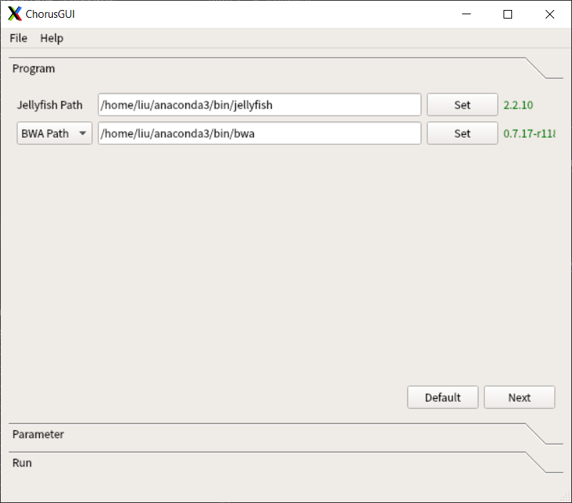
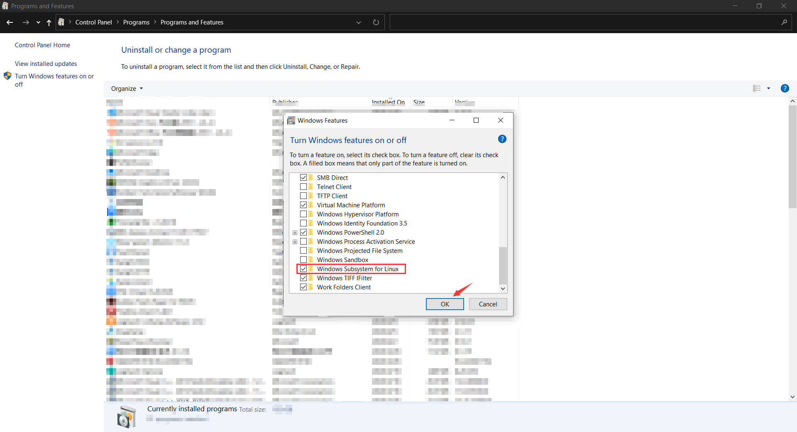

Install
========

Docker (For Unix & Windows)
----------------------------

Install Docker_

.. _Docker: https://docs.docker.com/engine/installation/

Terminal version
*****************

Download Chorus2:

.. code-block:: bash

    $ docker pull forrestzhang/docker-chorus

    $ docker run -v $PWD:/home/chorus -e CHORUS_USER=$USER -e CHORUS_UID=$UID forrestzhang/docker-chorus -h

    usage: Chorus [-h] [--version] [-j JELLYFISH] [-b BWA] -g GENOME -i INPUT
              [-s SAVED] [-p PRIMER] [-t THREADS] [-l LENGTH]
              [--homology HOMOLOGY] [-d DTM] [--docker DOCKER]

    Chorus Software for Oligo FISH probe design

    optional arguments:
    -h, --help            show this help message and exit
    --version             show program's version number and exit
    -j JELLYFISH, --jellyfish JELLYFISH
                          jellyfish path
    -b BWA, --bwa BWA     bwa path
    -g GENOME, --genome GENOME
                          fasta format genome file
    -i INPUT, --input INPUT
                          fasta format input file
    -s SAVED, --save SAVED
                          result saved folder
    -p PRIMER, --primer PRIMER
                          5' labeled R primer
    -t THREADS, --threads THREADS
                          threads number or how may cpu you wanna use
    -l LENGTH, --length LENGTH
                          probe length
    --homology HOMOLOGY   homology, from 50 to 100
    -d DTM, --dtm DTM     dTm, from 0 to 37
    --docker DOCKER

GUI version
************

Download Chorus2:

.. code-block:: bash

    $ docker pull forrestzhang/chorus-gui

    $ docker run -i -t -p 6080:80 -v $PWD:/root/Desktop/Data forrestzhang/chorus-gui

Open your web browse, enter http://localhost:6080

In your web browse, open a LXTerminal

.. code-block:: bash

    $ python3 /opt/software/Chorus/ChorusGUI.py

.. image:: _static/docker_GUI.jpg

Manually Install
-----------------

Linux (Ubuntu 18.04)
*********************

Manually install all packages
^^^^^^^^^^^^^^^^^^^^^^^^^^^^^^

Install dependent package

.. code-block:: bash

    $ apt-get update && apt-get install  -y build-essential \
        cython3 \
        zlib1g-dev \
        zlibc \
        openjdk-7-jre \
        git \
        libboost-dev \
        autoconf \
        libncursesw5-dev \
        libncurses5 \
        ncurses-dev \
        libboost-thread-dev \
        python3-pip \
        samtools \
        bcftools \
        unzip \
        python \
        curl \
        wget

Install jellyfish

.. code-block:: bash

    $ mkdir /opt/software

    $ cd /opt/software

    $ wget https://github.com/gmarcais/Jellyfish/releases/download/v2.3.0/jellyfish-2.3.0.tar.gz

    $ tar zxvf jellyfish-2.3.0.tar.gz

    $ mv jellyfish-2.3.0  jellyfish

    $ cd jellyfish

    $ ./configure && make && make install

Install bwa

.. code-block:: bash

    $ cd /opt/software

    $ git clone https://github.com/lh3/bwa.git

    $ cd bwa

    $ make

Install primer3-py

.. code-block:: bash

    $ cd /opt/software

    $ wget https://github.com/forrestzhang/primer3-py/archive/unicode.zip

    $ unzip unicode.zip

    $ cd primer3-py-unicode

    $ python3 setup.py install

Download Chorus2 and test the terminal version

.. code-block:: bash

    $ cd /opt/software

    $ git clone https://github.com/zhangtaolab/Chorus2.git

    $ pip install -r /opt/software/Chorus2/requirements.txt

    $ python3 /opt/software/Chorus2/Chorus2.py -h
    usage: Chorus2 [-h] [--version] [-j JELLYFISH] [-b BWA] -g GENOME -i INPUT
                [-s SAVED] [-p PRIMER] [-t THREADS] [-l LENGTH]
                [--homology HOMOLOGY] [-d DTM] [--skipdtm SKIPDTM]
                [--step STEP] [--docker DOCKER] [--ploidy PLOIDY]

    Chorus2 Software for Oligo FISH probe design

    optional arguments:
    -h, --help            show this help message and exit
    --version             show program's version number and exit
    -j JELLYFISH, --jellyfish JELLYFISH
                          The path where Jellyfish software installed
    -b BWA, --bwa BWA     The path where BWA software installed
    -g GENOME, --genome GENOME
                          Fasta format genome file, should include all sequences
                          from genome
    -i INPUT, --input INPUT
                          Fasta format input file, can be whole genome, a
                          chromosome or one region from genome
    -s SAVED, --save SAVED
                          The output folder for saving results
    -p PRIMER, --primer PRIMER
                          A specific 5' labeled R primer for PCR reaction. For
                          example: CGTGGTCGCGTCTCA. (Default is none)
    -t THREADS, --threads THREADS
                          Number of threads or CPUs to use. (Default: 1)
    -l LENGTH, --length LENGTH
                          The probe length. (Default: 45)
    --homology HOMOLOGY   The maximum homology(%) between target sequence and
                          probe, range from 50 to 100. (Default: 75)
    -d DTM, --dtm DTM     The minimum value of dTm (hybrid Tm - hairpin Tm),
                          range from 0 to 37. (Default: 10)
    --skipdtm SKIPDTM     skip calculate dtm, for oligo longer than 50.
    --step STEP           The step length for k-mer searching in a sliding
                          window, step length>=1. (Default: 5)
    --docker DOCKER       Only used in Docker version of Chorus
    --ploidy PLOIDY       The ploidy of the given genome (test version).
                          (Default: 2)

    Example:
    Chorus2 -i TAIR10_chr_all.fas -g TAIR10_chr_all.fas -t 4 \
            -j /opt/software/jellyfish/bin/jellyfish -b /opt/software/bwa/bwa -s sample

Install GUI dependencies and test the GUI version

.. code-block:: bash

    $ cd /opt/software/

    $ pip install -r /opt/software/Chorus2/requirements_GUI.txt

    $ python3 /opt/software/Chorus2/ChorusGUI.py

Install Chorus2 directly by Anaconda (**Recommended**)
^^^^^^^^^^^^^^^^^^^^^^^^^^^^^^^^^^^^^^^^^^^^^^^^^^^^^^^

Download and Install Anaconda_ (python 3.x verison for linux)

.. _Anaconda: https://www.anaconda.com/products/individual

.. code-block:: bash

    $ cd ~

    $ wget https://repo.anaconda.com/archive/Anaconda3-xxxx-Linux-x86_64.sh

    $ sh Anaconda3-xxxx-Linux-x86_64.sh

Add bioconda channel

.. code-block:: bash

    $ conda config --add channels conda-forge
    $ conda config --add channels defaults
    $ conda config --add channels bioconda

Install Chorus2 by conda

.. code-block:: bash

    $ conda create -n chorus chorus2

    $ conda activate chorus

    $ Chorus2 -h
    usage: Chorus2 [-h] [--version] [-j JELLYFISH] [-b BWA] -g GENOME -i INPUT
                [-s SAVED] [-p PRIMER] [-t THREADS] [-l LENGTH]
                [--homology HOMOLOGY] [-d DTM] [--skipdtm SKIPDTM]
                [--step STEP] [--docker DOCKER] [--ploidy PLOIDY]

    Chorus2 Software for Oligo FISH probe design

    optional arguments:
    -h, --help            show this help message and exit
    --version             show program's version number and exit
    -j JELLYFISH, --jellyfish JELLYFISH
                          The path where Jellyfish software installed
    -b BWA, --bwa BWA     The path where BWA software installed
    -g GENOME, --genome GENOME
                          Fasta format genome file, should include all sequences
                          from genome
    -i INPUT, --input INPUT
                          Fasta format input file, can be whole genome, a
                          chromosome or one region from genome
    -s SAVED, --save SAVED
                          The output folder for saving results
    -p PRIMER, --primer PRIMER
                          A specific 5' labeled R primer for PCR reaction. For
                          example: CGTGGTCGCGTCTCA. (Default is none)
    -t THREADS, --threads THREADS
                          Number of threads or CPUs to use. (Default: 1)
    -l LENGTH, --length LENGTH
                          The probe length. (Default: 45)
    --homology HOMOLOGY   The maximum homology(%) between target sequence and
                          probe, range from 50 to 100. (Default: 75)
    -d DTM, --dtm DTM     The minimum value of dTm (hybrid Tm - hairpin Tm),
                          range from 0 to 37. (Default: 10)
    --skipdtm SKIPDTM     skip calculate dtm, for oligo longer than 50.
    --step STEP           The step length for k-mer searching in a sliding
                          window, step length>=1. (Default: 5)
    --docker DOCKER       Only used in Docker version of Chorus
    --ploidy PLOIDY       The ploidy of the given genome (test version).
                          (Default: 2)

    Example:
    Chorus2 -i TAIR10_chr_all.fas -g TAIR10_chr_all.fas -t 4 \
            -j /opt/software/jellyfish/bin/jellyfish -b /opt/software/bwa/bwa -s sample

Test the GUI version

    $ ChorusGUI

MacOS
******

Install Chorus2 directly by Anaconda (**Recommended**)
^^^^^^^^^^^^^^^^^^^^^^^^^^^^^^^^^^^^^^^^^^^^^^^^^^^^^^^

Download and Install Anaconda_ (python 3.x Command Line Installer for MacOS)

.. _Anaconda: https://www.anaconda.com/products/individual

.. code-block:: bash

    $ cd ~

    $ wget https://repo.anaconda.com/archive/Anaconda3-xxxx-MacOSX-x86_64.sh

    $ sh Anaconda3-xxxx-MacOSX-x86_64.sh

Add bioconda channel

.. code-block:: bash

    $ conda config --add channels conda-forge
    $ conda config --add channels defaults
    $ conda config --add channels bioconda

Install Chorus2 by conda

.. code-block:: bash

    $ conda create -n chorus chorus2

    $ conda activate chorus

    $ Chorus2 -h
    usage: Chorus2 [-h] [--version] [-j JELLYFISH] [-b BWA] -g GENOME -i INPUT
                [-s SAVED] [-p PRIMER] [-t THREADS] [-l LENGTH]
                [--homology HOMOLOGY] [-d DTM] [--skipdtm SKIPDTM]
                [--step STEP] [--docker DOCKER] [--ploidy PLOIDY]

    Chorus2 Software for Oligo FISH probe design

    optional arguments:
    -h, --help            show this help message and exit
    --version             show program's version number and exit
    -j JELLYFISH, --jellyfish JELLYFISH
                          The path where Jellyfish software installed
    -b BWA, --bwa BWA     The path where BWA software installed
    -g GENOME, --genome GENOME
                          Fasta format genome file, should include all sequences
                          from genome
    -i INPUT, --input INPUT
                          Fasta format input file, can be whole genome, a
                          chromosome or one region from genome
    -s SAVED, --save SAVED
                          The output folder for saving results
    -p PRIMER, --primer PRIMER
                          A specific 5' labeled R primer for PCR reaction. For
                          example: CGTGGTCGCGTCTCA. (Default is none)
    -t THREADS, --threads THREADS
                          Number of threads or CPUs to use. (Default: 1)
    -l LENGTH, --length LENGTH
                          The probe length. (Default: 45)
    --homology HOMOLOGY   The maximum homology(%) between target sequence and
                          probe, range from 50 to 100. (Default: 75)
    -d DTM, --dtm DTM     The minimum value of dTm (hybrid Tm - hairpin Tm),
                          range from 0 to 37. (Default: 10)
    --skipdtm SKIPDTM     skip calculate dtm, for oligo longer than 50.
    --step STEP           The step length for k-mer searching in a sliding
                          window, step length>=1. (Default: 5)
    --docker DOCKER       Only used in Docker version of Chorus
    --ploidy PLOIDY       The ploidy of the given genome (test version).
                          (Default: 2)

    Example:
    Chorus2 -i TAIR10_chr_all.fas -g TAIR10_chr_all.fas -t 4 \
            -j /opt/software/jellyfish/bin/jellyfish -b /opt/software/bwa/bwa -s sample

Test the GUI version

    $ ChorusGUI

Windows 10 (WSL)
*****************

Install WSL (Windows Subsystem for Linux)
^^^^^^^^^^^^^^^^^^^^^^^^^^^^^^^^^^^^^^^^^^

Open *WSL* in **Control Panel - Programs and Features - Turn Windows features on or off**

After reboot computer, install *Ubuntu 18.04 LTS* in **Microsoft Store**

.. image:: _static/install_ubuntu.jpg

Launch **Ubuntu 18.04 LTS** App, Initiate the WSL (Ubuntu 18.04)

.. code-block:: bash

    $ sudo apt update

    $ sudo apt upgrage

    $ sudo apt install wget

Install Chorus2 directly by Anaconda
^^^^^^^^^^^^^^^^^^^^^^^^^^^^^^^^^^^^^

Download and Install Anaconda_ (python 3.x verison for linux)

.. _Anaconda: https://www.anaconda.com/products/individual

.. code-block:: bash

    $ cd ~

    $ wget https://repo.anaconda.com/archive/Anaconda3-xxxx-Linux-x86_64.sh

    $ sh Anaconda3-xxxx-Linux-x86_64.sh

Add bioconda channel

.. code-block:: bash

    $ conda config --add channels conda-forge
    $ conda config --add channels defaults
    $ conda config --add channels bioconda

Install Chorus2 by conda

.. code-block:: bash

    $ conda create -n chorus chorus2

    $ conda activate chorus

    $ Chorus2 -h
    usage: Chorus2 [-h] [--version] [-j JELLYFISH] [-b BWA] -g GENOME -i INPUT
                [-s SAVED] [-p PRIMER] [-t THREADS] [-l LENGTH]
                [--homology HOMOLOGY] [-d DTM] [--skipdtm SKIPDTM]
                [--step STEP] [--docker DOCKER] [--ploidy PLOIDY]

    Chorus2 Software for Oligo FISH probe design

    optional arguments:
    -h, --help            show this help message and exit
    --version             show program's version number and exit
    -j JELLYFISH, --jellyfish JELLYFISH
                          The path where Jellyfish software installed
    -b BWA, --bwa BWA     The path where BWA software installed
    -g GENOME, --genome GENOME
                          Fasta format genome file, should include all sequences
                          from genome
    -i INPUT, --input INPUT
                          Fasta format input file, can be whole genome, a
                          chromosome or one region from genome
    -s SAVED, --save SAVED
                          The output folder for saving results
    -p PRIMER, --primer PRIMER
                          A specific 5' labeled R primer for PCR reaction. For
                          example: CGTGGTCGCGTCTCA. (Default is none)
    -t THREADS, --threads THREADS
                          Number of threads or CPUs to use. (Default: 1)
    -l LENGTH, --length LENGTH
                          The probe length. (Default: 45)
    --homology HOMOLOGY   The maximum homology(%) between target sequence and
                          probe, range from 50 to 100. (Default: 75)
    -d DTM, --dtm DTM     The minimum value of dTm (hybrid Tm - hairpin Tm),
                          range from 0 to 37. (Default: 10)
    --skipdtm SKIPDTM     skip calculate dtm, for oligo longer than 50.
    --step STEP           The step length for k-mer searching in a sliding
                          window, step length>=1. (Default: 5)
    --docker DOCKER       Only used in Docker version of Chorus
    --ploidy PLOIDY       The ploidy of the given genome (test version).
                          (Default: 2)

    Example:
    Chorus2 -i TAIR10_chr_all.fas -g TAIR10_chr_all.fas -t 4 \
            -j /opt/software/jellyfish/bin/jellyfish -b /opt/software/bwa/bwa -s sample

Install dependent software for GUI and test the GUI version
^^^^^^^^^^^^^^^^^^^^^^^^^^^^^^^^^^^^^^^^^^^^^^^^^^^^^^^^^^^^

Download and Install Xming_

.. _Xming: https://sourceforge.net/projects/xming/

Open **Xming** App and test the GUI version

.. code-block:: bash

    $ ChorusGUI

